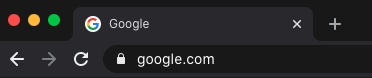

# Easy Purple Incognito Theme 

Incognito theme that makes easier to identify if you are navigating in incognito mode or not.

Default window  

Incognito window  

## Installation

Install via [Chrome Web Store](https://chrome.google.com/webstore/detail/easy-purple-incognito-mod/jgolkknoinekgblmggbdkdbempdhabpj?hl=en).

## Changelog

See [changelog file](./CHANGELOG.md) for notable changes to this project.
